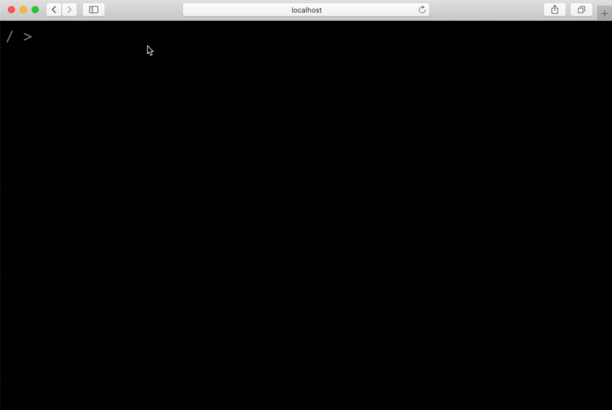

# Website 

My website, but it's a terminal.

## Local Development

Build the local file manifest and run the development server: `yarn run build:localFileManifest && yarn run start:dev`

## Production

Build for production: `yarn run build:localFileManifest && yarn run build:prod`
